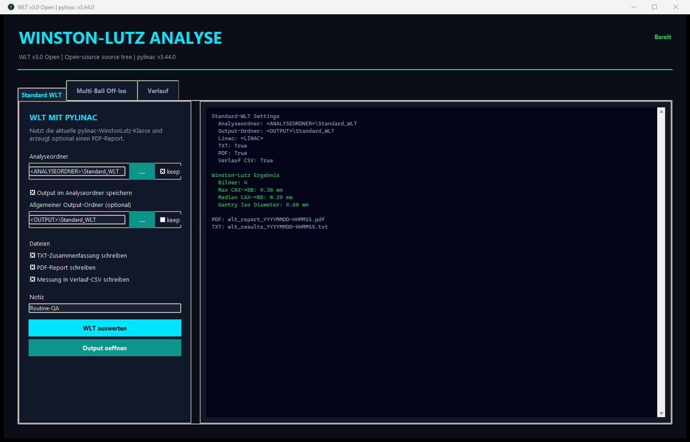
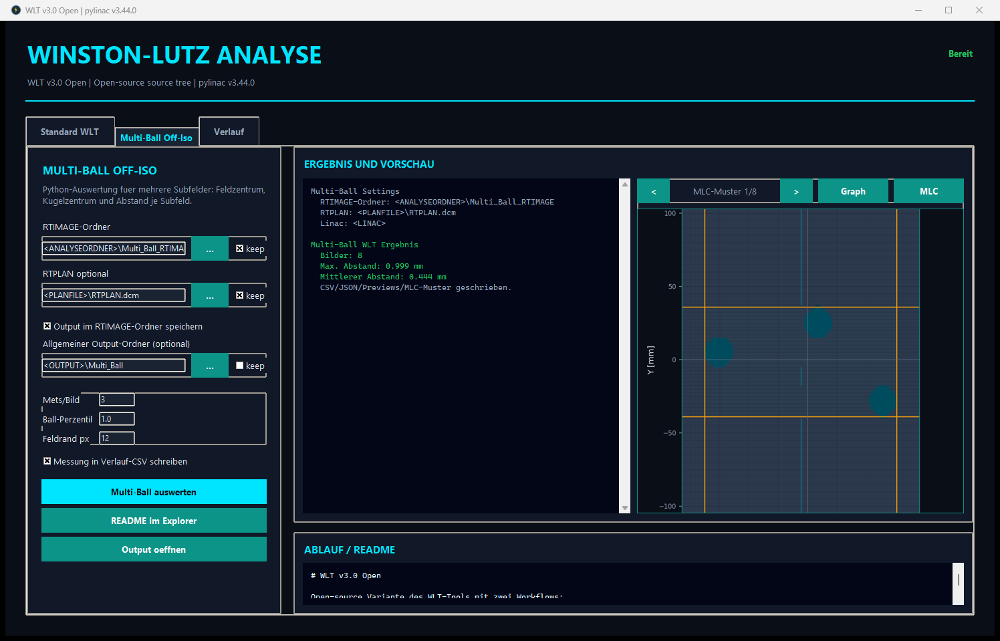
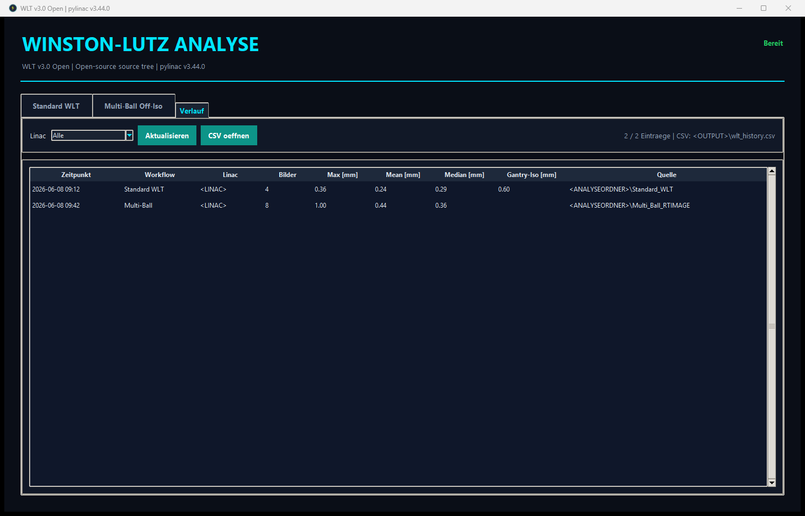

# Winston-Lutz Analyzer – bisherige Desktop-GUI

Die neue CT-referenzierte Auswertung hat eine eigene [portable Windows-GUI](https://github.com/Kiragroh/Python_WinstonLutzAnalyzer/releases/tag/multiwlt-gui-v0.2.0): ZIP vollständig entpacken, `MultiWLT.exe` starten, MV-Ordner, passendes Referenzprofil, gegebenenfalls RTRECORD-Ordner und Ausgabeordner auswählen. Die GUI erzeugt PDF, CSV und JSON mit abgezogenem CT-/Plan-Sollversatz. [Anleitung und vier Beispielaufnahmen](multiwlt/PORTABLE.md).

Der nachfolgend beschriebene ältere Multi-Ball-Reiter zieht diesen Sollversatz noch nicht ab. Für MultiWLT daher die neue separate GUI verwenden. Die anonymisierten Messdaten liegen als [GitHub-Downloads](multiwlt/data/README.md) vor; im Quellbaum liegt nur die synthetische Geometrie zum Softwaretest.

Desktop-Anwendung fuer die Auswertung von Winston-Lutz-Aufnahmen mit Python und
[`pylinac`](https://pylinac.readthedocs.io/). Das Repository enthaelt eine
generische Open-Source-Version ohne klinikspezifische Pfade, Betriebsdaten oder
DICOM-Beispieldaten.

## Funktionen

### Standard WLT

- Analyse eines Ordners mit WLT-DICOMs ueber `pylinac.WinstonLutz`
- TXT-Zusammenfassung und kombinierter PDF-Report
- Kennwerte fuer BB-Abstand und Isozentrum
- optionale lokale Verlaufs-CSV
- frei waehlbarer Analyse- und Ausgabeordner

### Multi-Ball Off-Iso

- Auswertung mehrerer Subfelder und Kugeln pro RTIMAGE
- automatische oder feste Anzahl erwarteter Subfelder
- optionale RTPLAN-Zuordnung ueber Gantry-, Kollimator- und Tischwinkel
- CSV-, JSON-, Preview- und Uebersichtsausgabe
- Darstellung von Jaws und MLC-Aperturen aus dem zugeordneten RTPLAN

## Installation

Voraussetzung ist Python 3.13 oder neuer.

```powershell
git clone https://github.com/Kiragroh/Python_WinstonLutzAnalyzer.git
cd Python_WinstonLutzAnalyzer
py -3.13 -m pip install -U pip
py -3.13 -m pip install -r requirements.txt
```

Start:

```powershell
.\start_open_gui.cmd
```

Installation ohne GUI-Start pruefen:

```powershell
.\start_open_gui.cmd -CheckOnly
```

Alternativ:

```powershell
py -3.13 wlt_open_gui.py
```

## Ausgabeordner

Ohne weitere Konfiguration nutzt die Anwendung den lokalen Ordner:

```text
output
```

In der GUI kann fuer beide Workflows ein beliebiger anderer Ausgabeordner
gewaehlt und mit `keep` gespeichert werden.

Optional kann vor dem Start ein gemeinsamer Standardordner gesetzt werden:

```powershell
$env:WLT_OUTPUT_ROOT = "D:\QA-Output"
.\start_open_gui.cmd
```

Die Anwendung legt darunter die Unterordner `WLT\Normal` und `WLT\Multi` an.
Die lokale Einstellung wird in `output\gui_settings.json` gespeichert und ist
von Git ausgeschlossen.

## Standard-WLT-Ablauf

1. Reiter **Standard WLT** oeffnen.
2. Ordner mit den WLT-DICOMs waehlen.
3. Ausgabe im Analyseordner oder in einem separaten Output-Ordner waehlen.
4. TXT und/oder PDF aktivieren.
5. **WLT auswerten** starten.

Erzeugte Dateien:

```text
wlt_results_<timestamp>.txt
wlt_report_<timestamp>.pdf
```

Der PDF-Report enthaelt ein kompaktes Deckblatt, eine Bilduebersicht und die
detaillierten pylinac-Seiten.

## Multi-Ball-Ablauf

Der Workflow sucht getrennte Feldinseln in den RTIMAGE-Daten und bestimmt
innerhalb jedes Subfelds Feld- und Kugelzentrum. Der Abstand wird mit der
RTIMAGE-SID auf die Isoebene skaliert:

```text
distance_iso_mm = distance_detector_mm * 1000 / RTImageSID
```

Erzeugte Dateien:

```text
multi_ball_wlt_<timestamp>.csv
multi_ball_wlt_<timestamp>.json
multi_ball_wlt_previews_<timestamp>\*.png
multi_ball_mlc_<timestamp>\*.png
multi_ball_wlt_graph_<timestamp>.png
```

Das RTPLAN wird fuer die Beam-Zuordnung und die MLC-/Jaw-Darstellung verwendet,
nicht fuer die numerische Bestimmung von Feld- oder Kugelzentrum.

## Kommandozeile

```powershell
python multi_ball_wlt.py ".\path\to\rtimage_folder" `
  --plan ".\path\to\rtplan.dcm" `
  --fields 3 `
  --output ".\output"
```

Automatische Feldanzahl:

```powershell
python multi_ball_wlt.py ".\path\to\rtimage_folder" `
  --fields auto `
  --output ".\output"
```

## Oberflaeche

Die Abbildungen verwenden neutrale Platzhalter und enthalten keine klinischen
DICOM-Daten.

### Standard WLT



### Multi-Ball MLC-Ansicht



### Lokaler Verlauf



## Datenschutz und Einsatzgrenzen

- Keine klinischen DICOMs, Reports oder Ergebnisdaten in Git einchecken.
- Fuer Tests nur anonymisierte oder synthetische RTIMAGE-/RTPLAN-Daten nutzen.
- Ergebnisse vor einer praktischen Nutzung anhand der Bild-Previews
  plausibilisieren.
- Das Tool ist keine Live-Messung und erzeugt keine Bestrahlungsplaene.
- Lokale Toleranzen, Koordinaten- und Vorzeichenkonventionen muessen durch den
  Anwender festgelegt und validiert werden.

## Lizenz

MIT, siehe [LICENSE.txt](LICENSE.txt).
