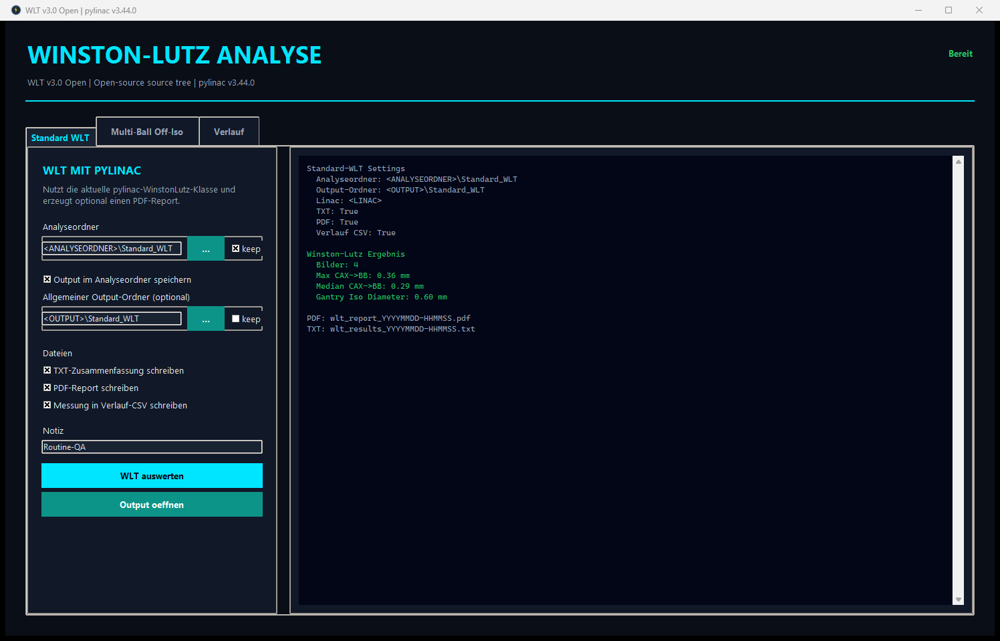
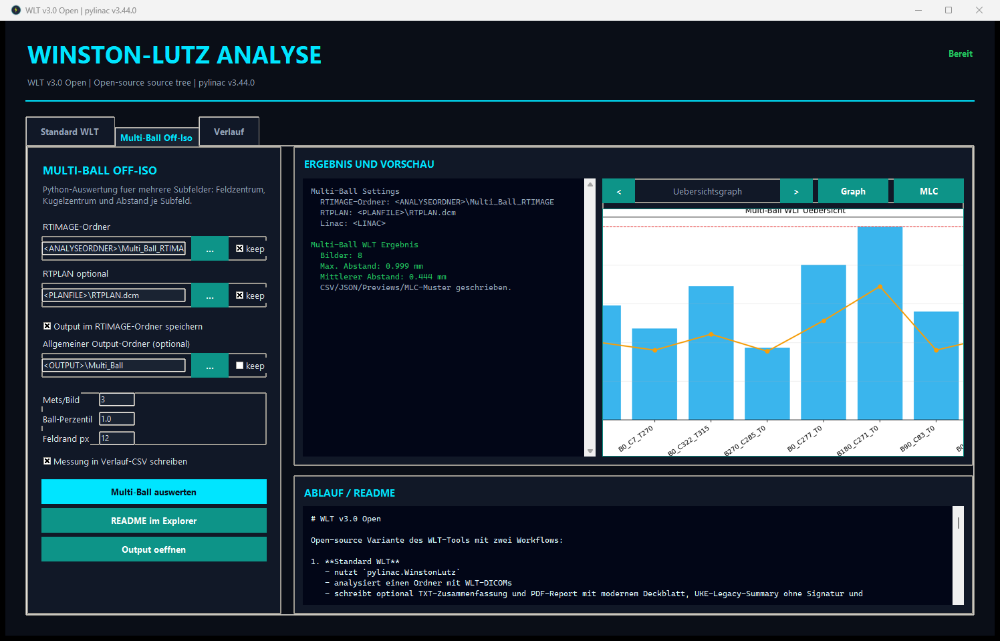
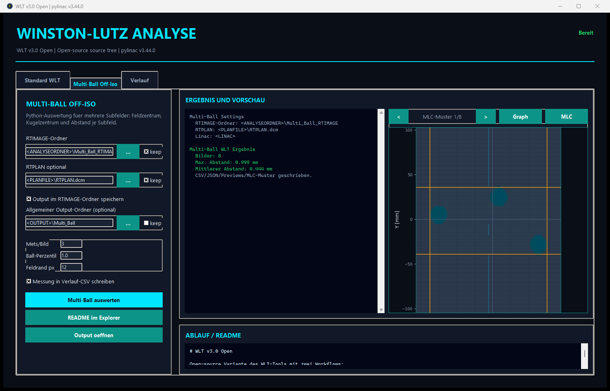
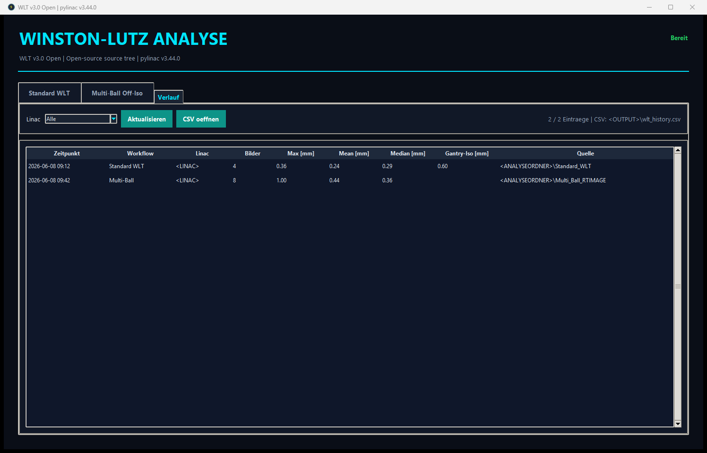

# WLT v3.0 Open

Open-source Variante des WLT-Tools mit zwei Workflows:

1. **Standard WLT**
   - nutzt `pylinac.WinstonLutz`
   - analysiert einen Ordner mit WLT-DICOMs
   - schreibt optional TXT-Zusammenfassung und PDF-Report mit modernem Deckblatt, UKE-Legacy-Summary ohne Signatur und pylinac-Detailseiten
   - kann die Ergebnisdateien im Analyseordner oder in einem allgemeinen Output-Ordner ablegen
   - schreibt optional eine lokale Verlaufs-CSV

2. **Multi-Ball Off-Iso**
   - Python-Auswertung fuer Multi-Ball-/Multi-Target-Off-Iso-Tests
   - erwartet standardmaessig drei Subfelder/Kugeln pro RTIMAGE, kann optional automatisch zaehlen
   - kann optional ein RTPLAN-DICOM laden, um Bilder ueber Gantry/Kollimator/Tisch Beam-Namen zuzuordnen
   - schreibt CSV, JSON, Einzelbild-Previews, MLC-Muster aus dem RTPLAN und einen Uebersichtsgraphen

Diese Open-Version enthaelt keine privaten Serverpfade, keine Userliste und keine zentralen CSV-Records. Die produktive MG-Variante bleibt davon getrennt.

## Installation

```powershell
cd WLT_v3.0_open
py -3.14 -m pip install -U pip
py -3.14 -m pip install -r requirements.txt
```

Start:

```powershell
.\start_open_gui.cmd
```

Der Starter nutzt das globale Python 3.14 des PCs. Er legt keine `.venv` an.

## Screenshots

Die Screenshots zeigen anonymisierte Beispiel-Auswertungen. Pfade, Linac-Namen und lokale Userdaten sind bewusst durch Platzhalter ersetzt.

### Standard WLT nach Auswertung



### Multi-Ball Off-Iso nach Auswertung



### Multi-Ball MLC-Muster



### Verlauf



## Lokale GUI-Settings

Die GUI merkt sich Pfade lokal in:

```text
output\gui_settings.json
```

Fuer jede Pfadzeile gibt es einen `keep`-Schalter:

- `keep` aus: Beim naechsten Start wird der zuletzt genutzte Pfad geladen.
- `keep` an: Der aktuelle Pfad bleibt fixiert und wird nicht durch spaetere Analysen ueberschrieben.
- Um einen fixierten Pfad zu aendern, neuen Pfad waehlen und `keep` aktiv lassen oder `keep` kurz aus/an schalten.

Die Settings-Datei ist bewusst lokal und wird nicht fuer eine Open-Source-Veroeffentlichung versioniert.

## Standard WLT Ablauf

1. Reiter **Standard WLT** oeffnen.
2. Analyseordner mit WLT-DICOMs waehlen.
3. Waehlen, ob Output im Analyseordner oder im allgemeinen Output-Ordner landet.
4. TXT und/oder PDF aktivieren.
5. **WLT auswerten** klicken.

Die App schreibt:

- `wlt_results_<timestamp>.txt`
- `wlt_report_<timestamp>.pdf`
- optional einen Eintrag in `output\wlt_history.csv`

Der PDF-Report enthaelt ein kompaktes WLT-Deckblatt mit pylinac-Version und Kennwerten; danach folgt der originale pylinac-Fachreport. Nach erfolgreicher Analyse oeffnet die GUI den PDF-Report automatisch.

Die Analyse ist bewusst generisch und nutzt die aktuelle pylinac-API. Spezialausgaben der privaten MG-Version sind hier nicht enthalten.

## Multi-Ball Off-Iso Ablauf

Der Workflow ist als generische Python-Auswertung fuer RTIMAGE-DICOMs mit mehreren getrennten Subfeldern aufgebaut:

1. Fuer jedes RTIMAGE werden die hellen Subfelder gesucht.
2. Je Subfeld wird der Innenbereich leicht erodiert, damit Feldkanten nicht stoeren.
3. Innerhalb jedes Subfelds wird die dunkle Kugelstruktur gesucht.
4. Feldzentrum und Kugelzentrum werden bestimmt.
5. Der Abstand wird vom Detektor auf Iso-Ebene skaliert:

```text
distance_iso_mm = distance_detector_mm * 1000 / RTImageSID
```

Die GUI schreibt:

- `multi_ball_wlt_<timestamp>.csv`
- `multi_ball_wlt_<timestamp>.json`
- `multi_ball_wlt_previews_<timestamp>\*.png`
- `multi_ball_mlc_<timestamp>\*.png`, wenn ein RTPLAN mit MLC-Daten geladen wurde
- `multi_ball_wlt_graph_<timestamp>.png`

Die Einzelbild-Previews zeigen gruene Feldkonturen, rote Kugelkonturen und die berechneten Abstaende. Der Graph fasst Maximal- und Mittelwerte je Bild zusammen. Die MLC-Ansicht ist ein PlanFile-Viewer fuer die gematchten Beams; sie zeigt Jaws, MLC-Baenke und die daraus entstehende Apertur, ist aber nicht Teil der numerischen Kugel-/Feldzentrumsauswertung.

### PlanFile und Zuordnung

Das RTPLAN kann ausgetauscht werden, solange es ein regulaeres RTPLAN-DICOM mit `BeamSequence` und `ControlPointSequence` ist. In dieser Open-Variante wird das PlanFile aber nur fuer die Beam-Zuordnung verwendet:

- Bildwinkel aus dem RTIMAGE: Gantry, Kollimator, Tisch
- Plan-Beams aus dem RTPLAN: Gantry, Kollimator, Tisch
- Zuordnung: kleinste zyklische Winkelsumme

Die Reihenfolge der Bilder ist damit nicht entscheidend. Gerade bei unterschiedlichen Tischwinkeln ist die Winkelsumme wichtig; sie wird in Terminal, CSV und Ergebnistext ausgegeben. Zusaetzlich werden Bildwinkel und gematchte Planwinkel nebeneinander ausgegeben, weil Beam-Namen nicht immer eindeutig zur DICOM-Winkelkonvention passen. Wenn der Match ausserhalb der Toleranz liegt, steht dort `nearest: ...` mit Warnhinweis.

Wenn der gematchte Beam MLC-Daten enthaelt, wird zusaetzlich ein MLC-Muster gerendert. In der GUI kann nach der Analyse ueber `MLC` zwischen den Plan-Aperturen pro Bild geblaettert werden.

### Anzahl Mets/Subfelder

`Mets/Bild = 3` ist der robuste Default fuer die vorhandenen Beispielbilder. Fuer andere Phantom-Setups kann `auto` verwendet werden. Auto sucht alle getrennten, ausreichend grossen hellen Feldinseln. Das ist flexibler, muss aber visuell ueber die Previews kontrolliert werden, weil Artefakte oder zusammenhaengende Feldformen die Zaehllogik beeinflussen koennen.

## Beispiel-Daten

Diese Open-Variante enthaelt bewusst keine klinischen Beispiel-DICOMs. Fuer Tests sollten anonymisierte oder synthetische RTIMAGE-/RTPLAN-Daten genutzt werden.

## CLI fuer Multi-Ball

```powershell
python multi_ball_wlt.py ".\path\to\rtimage_folder" `
  --plan ".\path\to\rtplan.dcm" `
  --fields 3 `
  --output ".\output"
```

Automatische Feldanzahl:

```powershell
python multi_ball_wlt.py ".\path\to\rtimage_folder" --fields auto --output ".\output"
```

## Grenzen

- Der Multi-Ball-Workflow ist aktuell fuer RTIMAGE-Daten mit getrennten Subfeldern gedacht.
- Es ist keine Live-Messung und keine automatische Planerzeugung.
- Das RTPLAN wird derzeit zur Beam-Zuordnung genutzt, nicht zur geometrischen Simulation der MLC- oder Jaw-Kontur.
- Die Toleranzbewertung ist bewusst nicht hart codiert; sie sollte lokal definiert werden.

## Lizenz

Im Ordner liegt eine MIT-Lizenzdatei als Startpunkt. Vor einer oeffentlichen Veroeffentlichung bitte pruefen, ob alle enthaltenen Daten, Logos und Textteile wirklich freigegeben werden duerfen.
