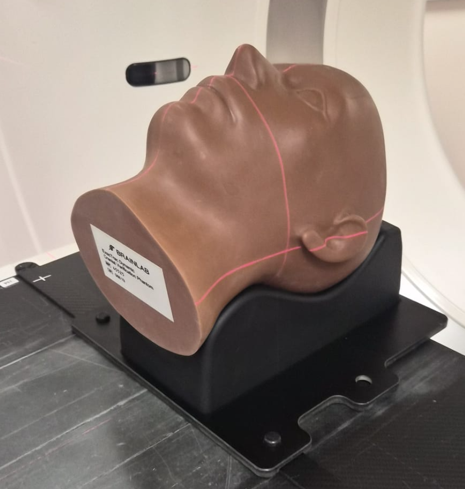
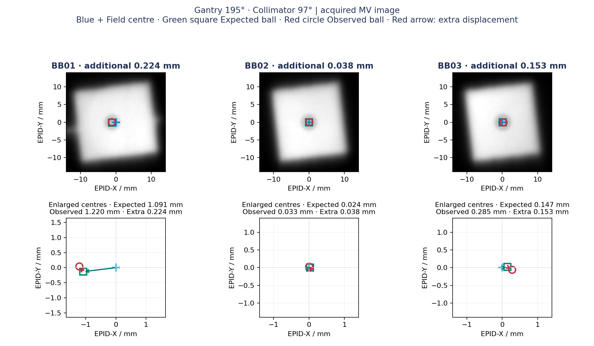
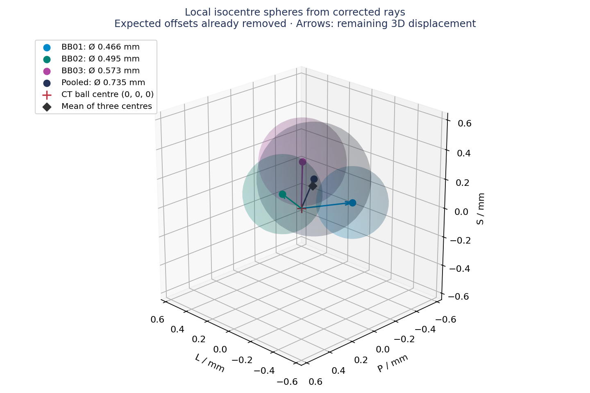

# CT-referenced MultiWLT

Research prototype for a static, three-target, off-isocentre Winston–Lutz test with a Brainlab head phantom and a TrueBeam HD120 MLC. Four MV images provide twelve target–aperture measurements. This repository presents the **initial Leipzig test from 25 September 2026, performed by Dr. Sebastian Schäfer**, not a commissioned clinical protocol.



## What is measured?

The projected CT ball centre does not necessarily coincide with the centre of its MLC opening. Subtract the expected **vector**, not the difference between two distance magnitudes:

```
expected = projected CT ball centre − planned aperture centre
observed = measured MV ball centre − measured MV field centre
extra    = observed − expected
```

CT ball centres come from the imaged dense spheres, not GTV centroids. Field centres use opposing 50% edges; pylinac locates the openings and independently detects the balls. There is no fit of the phantom pose to the MV images and no recentering that removes a common measured shift.



Cyan cross: measured field centre. Green square: expected ball centre relative to that field. Red circle: measured ball centre. The arrow from green to red is the extra displacement. The public module provides English plot labels, HTML/PDF reports, CSV headings and diagnostic messages.

## Initial measured results

Three balls lie approximately 48.7, 59.9 and 75.2 mm from the planned isocentre. Planned couch angle: 0°. Gantry/collimator pairs: 20°/54°, 105°/93°, 195°/97°, 285°/41°.

| Gantry | BB01 extra / mm | BB02 extra / mm | BB03 extra / mm |
|---|---:|---:|---:|
| 20° | 0.466 | 0.508 | 0.505 |
| 105° | 0.099 | 0.337 | 0.428 |
| 195° | 0.224 | 0.038 | 0.153 |
| 285° | 0.119 | 0.290 | 0.231 |

All twelve pairs were detected. The largest extra 2D displacement is **0.508 mm**. BB03 at gantry 285° needs field-centre method review: area centroid and opposing-edge centre differ by 0.697 mm. These are initial measurements without an established uncertainty budget or a clinical pass/fail decision. The source R6 plan geometry is corroborated by delivery records (maximum leaf discrepancy 0.03 mm, consistent with rounding); the imported-plan RTPLAN return export is still pending. Delivery records do not redefine the expected opening.

For example, BB01 at gantry 195° has an expected offset of approximately 1.091 mm at the recorded beam angles, but only **0.224 mm extra displacement**. The large raw offset is predominantly planned. Full component values are in [initial_results.csv](examples/initial_results.csv). The [English example report](examples/initial_report_en.pdf) shows the overview and all four acquired views.

## Local 3D ray envelopes

Corrected divergent rays are backprojected and referred to the local origin of each CT ball. A minimax fit finds the smallest sphere intersecting all sampled rays. Its diameter describes their spread; the centre displacement is the distance from the fitted local sphere centre to that same ball’s CT centre. The planned aperture offset has already been subtracted in each image before this 3D fit. This is a remaining 3D displacement relative to the CT ball location, not the plan isocentre; do not apply the aperture correction twice. Keep the maximum extra 2D displacement as the primary routine metric, before any sphere fit.

| Target | Local sphere diameter / mm | Centre displacement / mm |
|---|---:|---:|
| BB01 | 0.466 | 0.330 |
| BB02 | 0.495 | 0.420 |
| BB03 | 0.573 | 0.343 |
| All rays, after local-origin alignment | 0.735 | 0.207 |

The pooled sphere is fitted directly to all twelve corrected rays after translating each ray by its own CT ball position. Ray directions and millimetre scale are preserved. Individually fitted centres are not subtracted. It is the smallest sphere intersecting every ray, not a bounding sphere around the three individual fitted spheres. Consequently, the individual spheres do not have to lie entirely inside it.

The mean of the three diameters is 0.512 mm. Their mean centre is approximately (−0.054, −0.048, +0.157) mm in LPS coordinates. Neither quantity is the pooled sphere. These are sampled, combined gantry/collimator/MLC/setup results; they are not an isolated gantry-axis measurement, a confidence region, a setup correction instruction, or proof of full-arc accuracy. Parallel rays yield only a 2D envelope, not an observable 3D centre.



## Positioning and acquisition

1. SGRT may be used for initial positioning.
2. Load the matching phantom plan and align to the reference CT using CBCT or ExacTrac.
3. Acquire the four planned static MV views without changing the corrected phantom position.
4. In ARIA, add an **MVHighQuality** image to each field; this worked for the initial four images without switching to service mode.

The four initial images were acquired with the ARIA **MVHighQuality** preset, as confirmed by the operator. Their DICOM metadata report `Highres` / `Single`. No service-mode acquisition was required for this dataset. A nonzero couch encoder after image-guided correction is not automatically an additional residual phantom rotation. Confirm the CT-aligned pose explicitly. Any remaining physical positioning error stays part of the measurement.

## Run the synthetic example

Tested locally with Python 3.13. Use a virtual environment and run from this folder:

```sh
python -m pip install -r requirements.txt
python demo.py --output demo_output
python -m pytest tests -q
```

The demo generates four labelled synthetic RTIMAGE files with an injected panel shift of (+0.55, −0.35) mm and verifies recovery. It is an algorithm check, not a simulated clinical measurement or an additional measured result. The included `SYNTHETIC_geometry.dcm` is an **analysis fixture**, with newly generated identifiers and only geometric fields; it is incomplete for irradiation and must not be used as a deliverable treatment plan.

## Analyse acquired images

The external, deidentified imaging dataset is not yet included. Its future URL belongs in [data/manifest.json](data/manifest.json). No acquired DICOM files, patient-labelled TPS screenshots or internal network paths are included here.

```sh
python analyse.py local_data/MV --profile local_data/reference.json --records local_data/Positioning --positioned-in-ct --output results
```

Use the matching CT-derived reference and RTPLAN, not the synthetic fixture, for acquired data. Plan identity, plan hash, field geometry, image orientation and scale are checked. A changed plan UID requires matching delivery-record evidence; the expected geometry remains the reference plan. Missing or inconsistent metadata fail explicitly. The current detector supports three rectangular openings, normal EPID orientation, HFS geometry, and one image per configured static field. Separate setup/correction states into separate acquisitions; their encoder corrections cannot be mixed silently. A compact PDF measurement report starts with the sphere overview and the maximum extra 2D displacement as its overall metric, followed by measured values and individual MV views. Overlays, CSV and JSON are also produced. Research outlook is kept out of the measurement report. No automatic clinical tolerance decision is made.

## Use your own phantom, CT and plan

**Our expected offsets are not universal.** They depend on CT-visible ball centres, plan isocentre, gantry/collimator/couch angles and actual planned apertures. A different CT/plan combination needs newly calculated expected vectors. The same phantom model does not establish that its inserts and ball centres are identical to ours.

The read-only inspection tool fits imaged dense spheres independently of GTV contours. It compares inter-ball distances with the reference and generates a new analysis profile from your own static RTPLAN. Matching pairwise distances describe internal geometry only: they do not prove identical phantom orientation, alignment to isocentre, or suitable openings.

1. Put one conventional axial **HFS** CT series in a local directory. The CT and plan must already share their DICOM frame of reference. Do not change UIDs to force a match.
2. Identify the same three balls in your CT viewer. Record approximate centres in **DICOM LPS millimetres** (not image indices or an unspecified TPS user coordinate system). These positions seed the image fit; they are not the reported centres. Provide the physical nominal outer ball diameter and review the fitted dense-core diameter separately.
3. Create `local_data/seeds.json`, replacing every coordinate below with your own values:

```json
{"balls": [
  {"id": "BB01", "approx_center_lps_mm": [0, 0, 0], "nominal_diameter_mm": 8},
  {"id": "BB02", "approx_center_lps_mm": [0, 0, 0], "nominal_diameter_mm": 8},
  {"id": "BB03", "approx_center_lps_mm": [0, 0, 0], "nominal_diameter_mm": 8}
]}
```

Zeros are placeholders, not valid seed positions. The diameter is an example for the present nominal 8-mm configuration; verify your insert specification.

```sh
python inspect_phantom.py --ct local_data/CT --plan local_data/plan.dcm --seeds local_data/seeds.json --compare-reference example_reference/reference.json --output local_data/own_reference
```

Review `ct_centres.png`, `ct_ball_fits.json`, `ball_layout_comparison.json` and `expected_offsets.csv`. If supported, `reference.json` and a byte-identical **local** plan copy are produced. The output can contain local DICOM identifiers; keep it out of Git. Use the new reference for analysis:

```sh
python analyse.py local_data/MV --profile local_data/own_reference/reference.json --records local_data/Positioning --positioned-in-ct --output results
```

The current implementation supports three high-density spheres, axial HFS CT, one isocentre, static MLCX beams and three separate rectangular openings approximately 15–25 mm wide/high. The high-HU fit uses 1500/2000/2500 HU; low-density inserts or different marker shapes need a different localisation method. Nominal ball-edge clearance and detector search-window compatibility are checked. The default 1-mm geometric clearance gate is a software precondition, not a clinical safety margin or a substitute for verifying penumbra/segmentation.

If the balls do not match the openings, the tool retains CT fits and comparison plots but writes `PLAN_NOT_SUPPORTED.json` instead of an analysis profile. Adapt the plan and/or detection/projection logic, then validate with synthetic cases and a known-shift acquisition. The tool does not optimise apertures, certify phantom equivalence, or convert an incompatible MLC.

## Adapt a plan to another TrueBeam machine name

Use a locally reviewed **complete phantom RTPLAN**, with the same compatible HD120 leaf geometry:

```sh
python adapt_truebeam_plan.py source.dcm output.dcm --machine YOUR_TB_NAME --tolerance-label YOUR_TABLE --profile reference.json
```

`--tolerance-label` and `--profile` are optional. The table name must already exist locally; no table is guessed or created. The script changes the machine name and optionally the tolerance-table label, assigns new instance/series UIDs, resets approval, and optionally writes a matching analysis reference. Beam geometry, control points, energy, MU and CT/reference links are preserved. Existing files are never overwritten. This does **not** convert between HD120 and other MLCs or establish beam-model equivalence. Review/import the new plan through the local phantom QA process; the script neither connects to nor operates a treatment machine.

## Outlook: to be explored locally

Only the initial four-view results above have been measured. Proposed Leipzig extensions are separate research questions:

- Couch 0°, 45°, 315° and 270°, with four suitable gantry views per couch position and newly calculated openings. After each couch change, acquire once without a new ExacTrac correction, then correct and repeat. Use couch 0° as the shared reference.
- A lean variant has no additional collimator exposures. An extended variant adds two suitable collimator settings at a fixed gantry angle for each couch position: four versus six images per couch/correction state. Exact angles and apertures need a new verified plan. Analyse the collimator-only subset as a 2D envelope and keep the correction states separate.
- Conventional on-isocentre WLT with BB01 in the same head phantom, and a comparison with the usual WLT phantom.
- DCA with cine acquisition and angle-resolved expected and measured vectors. Dynamic analysis and delivery are not implemented in this static package.

Other institutions can explore these extensions after validating their own geometry and workflow. No future-series measurements or ready-to-deliver arc/couch plans are claimed here.

## Acknowledgements and related work

We warmly thank **Paul Rétif** for sharing his ideas, his earlier ImageJ script and practical experience with off-axis Winston–Lutz testing. His work and the paper below were an important starting point for this project.

Rétif P, Djibo Sidikou A, Waltener A, et al. **Integrating cine EPID, dynamic delivery, and the off-axis Winston-Lutz test to enhance quality control in multiple brain metastasis stereotactic radiotherapy.** *Physica Medica*. 2024;120:103343. [doi:10.1016/j.ejmp.2024.103343](https://doi.org/10.1016/j.ejmp.2024.103343).

The present implementation explores a static four-image workflow with CT-visible ball centres and expected offsets calculated directly from CT/RTPLAN geometry. It is inspired by this prior work; it is not a reproduction or validation of the published dynamic cine method. Paul’s ImageJ script and paper are not redistributed in this repository.

## Method, reuse and contribution

The ray-envelope concept follows the [pylinac Winston–Lutz documentation](https://pylinac.readthedocs.io/en/latest/winston_lutz.html), with explicit CT off-axis projection and planned-offset subtraction. Compare also [pylinac multi-target documentation](https://pylinac.readthedocs.io/en/latest/winston_lutz_multi.html). This package uses pylinac detection utilities; its expected-offset correction and reporting are custom code.

Code is under the [MIT licence](LICENSE). See [THIRD_PARTY.md](THIRD_PARTY.md) for dependencies and media. Useful contributions include deidentified reproducible cases, known-shift checks, independent edge-centre comparisons and repeated-positioning uncertainty studies. Document detector conventions, plan/profile provenance and acquisition mode with each case; do not submit identifiable clinical exports.
